  <picture>
    <source media="(prefers-color-scheme: dark)" srcset="assets/profile.svg">
    <source media="(prefers-color-scheme: light)" srcset="assets/profile.svg">
    
  </picture>

---

### 🛠️ Stack Tecnológico

  <!-- Especialidades -->
  
  
  
    
  
  <!-- Lenguajes & Herramientas en Skillicons -->
  

---

### 📊 Métricas y Estadísticas

  <!-- TransferGit Card -->
  
    
  <!-- GitHub Stats Extended -->
  
  
    
  <!-- GitHub Streak -->
  

---

### 🚀 Proyectos Destacados

<table align="center">
  <tr>
    <td align="center" width="50%">
      <h4><a href="https://github.com/sandobaitt/ccr-landing">🕊️ CCR Landing Page</a></h4>
      
Landing page interactiva para la comunidad juvenil CCR.

    </td>
    <td align="center" width="50%">
      <h4><a href="https://github.com/sandobaitt/TPI-Paradigmas-">🏹 Sistema Dinámico Repulsor</a></h4>
      
Juego de tablero dinámico en Pharo y Python.

    </td>
  </tr>
  <tr>
    <td align="center" width="50%">
      <h4><a href="https://github.com/sandobaitt/Assembler">💻 Assembler 8086</a></h4>
      
Guía, ejercicios y finales resueltos en Assembler 8086.

    </td>
    <td align="center" width="50%">
      <h4><a href="https://github.com/sandobaitt/TpDiseno">🏋️ Diseño de Gimnasio</a></h4>
      
Diseño de un escenario para un gimnasio.

    </td>
  </tr>
</table>

---

### 🕹️ Contribuciones

  <picture>
    <source media="(prefers-color-scheme: dark)" srcset="https://raw.githubusercontent.com/sandobaitt/sandobaitt/output/pacman-contribution-graph-dark.svg">
    <source media="(prefers-color-scheme: light)" srcset="https://raw.githubusercontent.com/sandobaitt/sandobaitt/output/pacman-contribution-graph.svg">
    
  </picture>

---

### 📫 Contacto

  
  
  

 

  

